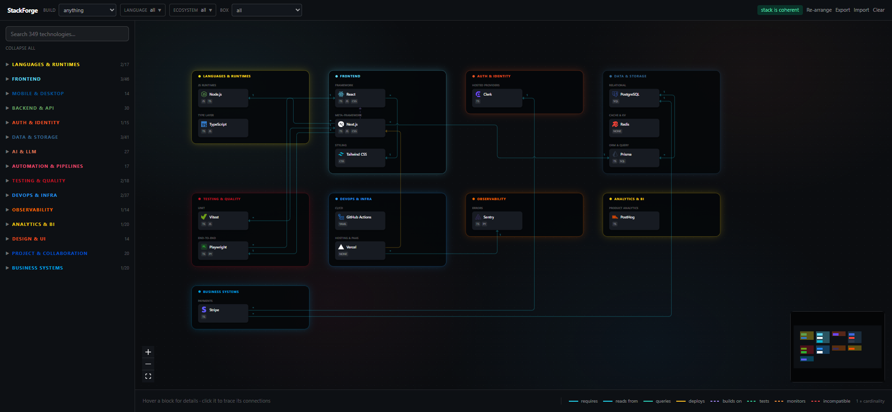

<p align="center">
  <a href="https://github.com/e-mdj7/StackForge">
    
  </a>
</p>

<h1 align="center">
  StackForge
</h1>

<p align="center">
  <strong>Visual technology-stack builder.</strong><br />
  Drop technologies onto a canvas and it tells you what conflicts, what is missing,
  and what connects to what.
</p>

<p align="center">
  <a href="https://stackforge.vercel.app" target="_blank">
    
  </a>
  <a href="https://github.com/e-mdj7/StackForge/actions/workflows/ci.yml">
    
  </a>
  <a href="#stack">
    
  </a>
</p>
<p align="center">
  <a href="#the-catalog">
    
  </a>
  <a href="#privacy">
    
  </a>
  <a href="#license">
    
  </a>
</p>

<p align="center">
  
</p>

---

## Why this exists

Every stack decision is really a question about a *relationship*. Does this ORM speak to
that database? If I take Firebase, what have I just ruled out? I have a queue and a
scheduler — do I actually still need a cron service? Those answers normally live in
twelve browser tabs, a whiteboard photo, and somebody's memory.

Architecture diagrams don't help, because a diagram is a drawing: it will happily let you
wire Prisma to Firestore, and it will never tell you that you have users but no way to log
them in. It knows where the boxes are, not what they mean.

StackForge is the other way round. Every technology is a data record with declared
capabilities, needs, conflicts and exclusive slots, so the picture is *derived* from the
rules rather than drawn by hand. Put two incompatible things on the canvas and one greys
out. Add an API with no database and it rings red until you fix it. The diagram cannot
show you a stack that could not exist.

## Features

**Compatibility, checked as you build**
- Hard conflicts grey the block out and say why — declare it once, it applies both ways
- Exclusive slots: two bundlers, two BaaS providers or two unit-test runners can't coexist
- Unmet needs ring a block red until something in the stack provides that capability
- Stack-wide rules catch gaps no single block can see: users with no auth, containers with no CI

**A diagram that reads like one**
- Wires are planned against every block and every other wire at once — they route *around*
  unrelated blocks instead of through them, keep a lane apart where they run together, and
  arc over one another where they cross
- Arrow direction is one promise everywhere: it points from the thing that depends on,
  reads from or acts on — to the thing it depends on. Mutual links are arrowed at both ends
- Solid lines are runtime dependencies, dashed lines referential; `1` / `∗` marks give cardinality
- Boxes appear and disappear with their contents; the layout re-columns itself to the window

**Finding things among 350 entries**
- Filter by **Build** — pick "SaaS product" and every block that plays a part lights up
  wearing the part it plays: n8n as `Glue`, Stripe as `Billing`, Vitest as `Tests`
- Filter by language or ecosystem tag; either way each box shows how much of it the filter covers
- Click a block to trace it: its arrows animate, neighbours stay lit, everything else fades
- **Needed / recommended** panel names each missing capability, who wants it, and what would fix it

**Yours, on your machine**
- Per-technology console URL, username, password and notes, in a drawer beside the block
- Export and import the whole stack as JSON
- Undo on delete, with credentials and position restored intact

## Run it

Requires Node 20+ and [pnpm](https://pnpm.io).

```bash
git clone https://github.com/e-mdj7/StackForge.git
cd StackForge
pnpm install
pnpm dev            # http://localhost:5173
```

| Script | What it does |
|---|---|
| `pnpm dev` | Dev server with hot reload |
| `pnpm build` | Type-check (`tsc -b`) and build to `dist/` |
| `pnpm preview` | Serve the production build |
| `pnpm check` | Rule engine, catalog integrity and wire-router tests |
| `pnpm lint` | oxlint |

Nothing to configure — there are no environment variables and no services to stand up.

Want something to try it on? `examples/stress-test.json` is a deliberately overloaded
94-technology stack (231 connections, every box populated) — load it with **Import**.

## Privacy

Everything runs in your browser. There is no backend, no account, no telemetry, and the
only network request is brand icons from `cdn.simpleicons.org`.

Saved passwords are encrypted with **AES-GCM (PBKDF2, 310k iterations)** before they reach
`localStorage`. The passphrase is held in memory for the session and never written
anywhere, so a stolen `localStorage` dump is ciphertext. Lose the passphrase and the saved
password is unrecoverable — including by you.

## The catalog

Everything is driven by **data, not code**. Each technology is one JSON object in
`src/catalog/<group>.json`:

```json
{
  "id": "supabase",
  "name": "Supabase",
  "group": "backend",
  "section": "Platform (BaaS)",
  "icon": "supabase",
  "color": "#3fcf8e",
  "langs": ["sql", "ts"],
  "desc": "Postgres with auth, storage and realtime on top. Use when you want a BaaS but refuse to give up SQL.",
  "provides": ["db", "db-sql", "auth", "storage", "realtime"],
  "exclusive": ["baas", "auth"],
  "links": [{ "to": "postgresql", "rel": "extends" }]
}
```

From those fields alone, `src/rules.ts` derives every behaviour:

| Field | What it produces |
|---|---|
| `conflicts` | Hard incompatibility. Firebase lists `postgresql`, so selecting one greys out the other with *"Firebase is not compatible with PostgreSQL"*. Symmetric — declare it once. |
| `exclusive` | Slot contention. Firebase and Supabase both claim `baas`; Vitest and Jest both claim `test-unit`. Pick one. |
| `needs` | Red ring + tooltip when nothing in the stack `provides` that capability, and an arrow to the provider when something does. |
| `links` | Typed arrows, drawn only when both ends are on the canvas. Vitest → Vite is `tests`; Next.js → React is `extends`. Optional `card` sets cardinality (`n-1`, `1-n`, `n-n`). |
| `langs` | The language-family badge on the block and the language filter. |
| `provides` | Feeds the stack-wide rules in `catalog/rules.json` — *users with no auth*, *self-hosted API with no database*, *containers with no CI*. |

Two more catalog files shape the rest:

- **`groups.json`** — the 15 boxes, their colour, their left-to-right dataflow order, and the sections inside each
- **`builds.json`** — what you might be building. Each build lists *roles* (`Glue`, `Billing`, `Data`…) and the `group:Section` slots that fill them, which is what the Build filter lights up

`entries.md` is the plain-text plan: what is in, what is queued. To add a technology, copy
a neighbour in the relevant JSON. To add a whole box, add it to `groups.json` with its
`sections`, create `<id>.json`, and add two lines to `src/catalog/index.ts`.

`pnpm check` fails loudly on a misspelled section name, a link pointing at a nonexistent
id, a `needs` capability nothing provides, or a build glob aimed at a section that doesn't exist.

## Stack

| | |
|---|---|
|  | UI |
|  | Types, and the test runner via `--experimental-strip-types` |
|  | Dev server and build |
|  | Styling, via `@tailwindcss/vite` |
|  | State and `localStorage` persistence |
|  | Canvas, panning, minimap |
|  | Linting |
|  | Package manager |

No UI kit, no state library beyond Zustand, no test framework — `node --test` and
`assert` do the job.

## Files

```
src/
  types.ts          the schema every JSON file follows
  rules.ts          conflicts, missing pieces, arrows      (+ rules.test.ts)
  routing.ts        orthogonal wire router: side choice,
                    sockets, lane separation, bridges      (+ routing.test.ts)
  layout.ts         auto-arranges boxes and blocks
  store.ts          zustand + localStorage, filter predicate
  crypto.ts         AES-GCM for the password field
  catalog/          groups.json, rules.json, builds.json,
                    15 technology files                    (+ catalog.test.ts)
  components/
    nodes.tsx       block, group box, typed edge
    panels.tsx      palette, top bar, legend, drawer
examples/
  stress-test.json  94 technologies, 231 connections
```

## Contributing

Adding a technology is a pull request against one JSON file. Run `pnpm check` first — it
catches almost every mistake you can make in the catalog. For behaviour changes, keep the
test alongside the module it covers.

## Credits

Built by <a href="https://github.com/e-mdj7">e-mdj7</a>, co-authored with
<a href="https://claude.com/claude-code">Claude Code</a> — which paired on the rule engine,
the orthogonal wire router in `src/routing.ts`, and the catalog schema.

## License

MIT — do what you want with it. See `LICENSE` for the exact text. — <a href="https://github.com/e-mdj7">e-mdj7</a>
